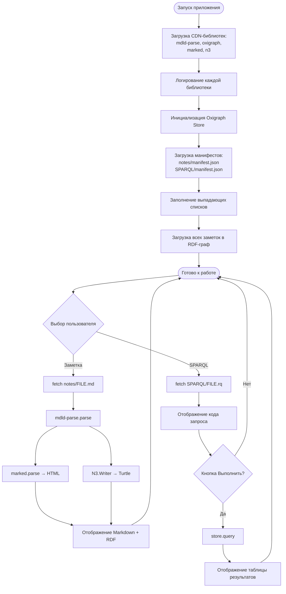

Ниже — обновлённый `index.html`, все вспомогательные файлы, подробное описание программы и схема алгоритма в Mermaid.

## 📋 Описание программы

Приложение — полностью клиентский просмотрщик семантического Zettelkasten на GitHub Pages. Оно:

1. **Загружает библиотеки через CDN** (mdld-parse, oxigraph, marked, n3) и пишет об этом в лог.
2. **Читает манифесты** `notes/manifest.json` и `SPARQL/manifest.json`, чтобы заполнить два выпадающих списка.
3. **Загружает все заметки** в единый RDF-граф (Oxigraph Store) при старте — каждое действие логируется.
4. **При выборе заметки**: скачивает `.md` файл, парсит его через `mdld-parse`, извлекает quads, рендерит Markdown без аннотаций (через `marked`) и сериализует RDF в Turtle (через `n3`). Обе панели показываются рядом.
5. **При выборе SPARQL-запроса**: загружает `.rq` файл, показывает его код, при нажатии **Выполнить** выполняет запрос к графу и отображает таблицу результатов.
6. **Лог-окно** внизу фиксирует все шаги: загрузку библиотек, файлов, ошибки, количество триплетов.

## 🔀 Схема алгоритма (Mermaid)



## 📄 `index.html`

```html
<!DOCTYPE html>
<html lang="ru">
<head>
  <meta charset="UTF-8">
  <meta name="viewport" content="width=device-width, initial-scale=1.0">
  <title>MD-LD Semantic Zettelkasten</title>
  <style>
    body {
      font-family: system-ui, -apple-system, sans-serif;
      max-width: 1400px;
      margin: 0 auto;
      padding: 1rem;
      background: #f5f5f5;
      color: #2c3e50;
    }
    h1 { color: #2c3e50; }
    h2 { color: #34495e; border-bottom: 2px solid #3498db; padding-bottom: 0.3rem; }
    section {
      background: white;
      padding: 1rem;
      margin: 1rem 0;
      border-radius: 6px;
      box-shadow: 0 1px 3px rgba(0,0,0,0.1);
    }
    select, button {
      padding: 0.5rem;
      font-size: 1rem;
      border-radius: 4px;
      border: 1px solid #ccc;
    }
    select { min-width: 320px; }
    button {
      background: #3498db;
      color: white;
      border: none;
      cursor: pointer;
      margin-left: 0.5rem;
    }
    button:hover:not(:disabled) { background: #2980b9; }
    button:disabled { background: #95a5a6; cursor: not-allowed; }
    .panel {
      display: grid;
      grid-template-columns: 1fr 1fr;
      gap: 1rem;
      margin-top: 1rem;
    }
    @media (max-width: 800px) {
      .panel { grid-template-columns: 1fr; }
    }
    .panel > div {
      border: 1px solid #ddd;
      border-radius: 4px;
      padding: 1rem;
      background: #fafafa;
      max-height: 550px;
      overflow: auto;
    }
    .panel h3 {
      margin-top: 0;
      color: #7f8c8d;
      font-size: 0.9rem;
      text-transform: uppercase;
      letter-spacing: 0.05em;
    }
    pre {
      background: #2c3e50;
      color: #ecf0f1;
      padding: 1rem;
      border-radius: 4px;
      overflow-x: auto;
      font-size: 0.85rem;
      line-height: 1.5;
      white-space: pre-wrap;
      word-break: break-word;
    }
    #log {
      background: #1a1a1a;
      color: #0f0;
      font-family: 'Courier New', monospace;
      font-size: 0.8rem;
      max-height: 260px;
      overflow-y: auto;
    }
    .markdown-view :is(h1,h2,h3) { margin-top: 0.5rem; }
    .markdown-view pre { background: #ecf0f1; color: #2c3e50; }
    .sparql-result table {
      border-collapse: collapse;
      width: 100%;
      font-size: 0.9rem;
    }
    .sparql-result th, .sparql-result td {
      border: 1px solid #ddd;
      padding: 0.4rem 0.6rem;
      text-align: left;
    }
    .sparql-result th { background: #ecf0f1; }
    .hint { color: #7f8c8d; font-size: 0.9rem; }
  </style>
</head>
<body>
  <h1>📚 MD-LD Semantic Zettelkasten</h1>
  <p class="hint">
    Клиентский просмотр заметок в Markdown и их RDF-представления, с выполнением
    SPARQL-запросов прямо в браузере. Без сервера, без сборки.
  </p>

  <!-- ============ ЗАМЕТКИ ============ -->
  <section>
    <h2>1. Заметки</h2>
    <label for="note-select">Выберите заметку:</label>
    <select id="note-select">
      <option value="">— загрузка списка заметок —</option>
    </select>
    <div class="panel">
      <div>
        <h3>Markdown (отрендеренный)</h3>
        <div id="note-markdown" class="markdown-view"><em>Заметка не выбрана</em></div>
      </div>
      <div>
        <h3>RDF (Turtle)</h3>
        <pre id="note-rdf"><em>—</em></pre>
      </div>
    </div>
  </section>

  <!-- ============ SPARQL ============ -->
  <section>
    <h2>2. SPARQL-запросы</h2>
    <label for="sparql-select">Выберите запрос:</label>
    <select id="sparql-select">
      <option value="">— загрузка списка запросов —</option>
    </select>
    <button id="run-sparql" disabled>Выполнить</button>
    <div class="panel">
      <div>
        <h3>Код запроса</h3>
        <pre id="sparql-code"><em>—</em></pre>
      </div>
      <div>
        <h3>Результат</h3>
        <div id="sparql-result" class="sparql-result"><em>—</em></div>
      </div>
    </div>
  </section>

  <!-- ============ ЛОГ ============ -->
  <section>
    <h2>3. Лог выполнения</h2>
    <pre id="log"></pre>
  </section>

  <script type="module">
    // ============================================================
    // Логирование
    // ============================================================
    const logEl = document.getElementById('log');
    function log(msg, type = 'info') {
      const time = new Date().toLocaleTimeString('ru-RU');
      const prefix = { info: 'ℹ', ok: '✓', warn: '⚠', err: '✗' }[type] || '·';
      logEl.textContent += `[${time}] ${prefix} ${msg}\n`;
      logEl.scrollTop = logEl.scrollHeight;
      console.log(`[${type}] ${msg}`);
    }

    log('=== Запуск приложения ===', 'info');

    // ============================================================
    // Загрузка библиотек через CDN
    // ============================================================
    let mdldParse, oxigraph, marked, N3;

    try {
      log('Загрузка mdld-parse с cdn.jsdelivr.net…', 'info');
      mdldParse = await import('https://cdn.jsdelivr.net/npm/mdld-parse/+esm');
      log('mdld-parse загружен', 'ok');
    } catch (e) {
      log(`Ошибка загрузки mdld-parse: ${e.message}`, 'err');
    }

    try {
      log('Загрузка oxigraph WASM…', 'info');
      const oxMod = await import('https://cdn.jsdelivr.net/npm/oxigraph@latest/web.js');
      await oxMod.default();
      oxigraph = oxMod;
      log('oxigraph WASM инициализирован', 'ok');
    } catch (e) {
      log(`Ошибка загрузки oxigraph: ${e.message}`, 'err');
    }

    try {
      log('Загрузка marked (Markdown → HTML)…', 'info');
      const m = await import('https://cdn.jsdelivr.net/npm/marked@latest/+esm');
      marked = m.marked || m.default || m;
      log('marked загружен', 'ok');
    } catch (e) {
      log(`Ошибка загрузки marked: ${e.message}`, 'err');
    }

    try {
      log('Загрузка n3 (сериализация Turtle)…', 'info');
      N3 = await import('https://cdn.jsdelivr.net/npm/n3@latest/+esm');
      log('n3 загружен', 'ok');
    } catch (e) {
      log(`Ошибка загрузки n3: ${e.message}`, 'err');
    }

    // ============================================================
    // Хранилище RDF
    // ============================================================
    const store = new oxigraph.Store();
    log('Создан пустой Oxigraph Store', 'ok');

    // ============================================================
    // Загрузка манифестов
    // ============================================================
    const noteSelect = document.getElementById('note-select');
    const sparqlSelect = document.getElementById('sparql-select');

    let noteList = [];
    let sparqlList = [];

    // --- Заметки ---
    try {
      log('Загрузка манифеста заметок: notes/manifest.json', 'info');
      const r = await fetch('./notes/manifest.json');
      if (!r.ok) throw new Error(`HTTP ${r.status}`);
      noteList = await r.json();
      log(`Получено ${noteList.length} заметок в манифесте`, 'ok');
      noteSelect.innerHTML = '<option value="">— выберите заметку —</option>' +
        noteList.map(f => `<option value="${f}">${f}</option>`).join('');
      log('Выпадающий список заметок заполнен', 'ok');
    } catch (e) {
      log(`Ошибка загрузки манифеста заметок: ${e.message}`, 'err');
      noteSelect.innerHTML = '<option value="">— ошибка загрузки —</option>';
    }

    // --- SPARQL ---
    try {
      log('Загрузка манифеста SPARQL: SPARQL/manifest.json', 'info');
      const r = await fetch('./SPARQL/manifest.json');
      if (!r.ok) throw new Error(`HTTP ${r.status}`);
      sparqlList = await r.json();
      log(`Получено ${sparqlList.length} SPARQL-запросов в манифесте`, 'ok');
      sparqlSelect.innerHTML = '<option value="">— выберите запрос —</option>' +
        sparqlList.map(f => `<option value="${f}">${f}</option>`).join('');
      log('Выпадающий список SPARQL заполнен', 'ok');
    } catch (e) {
      log(`Ошибка загрузки манифеста SPARQL: ${e.message}`, 'err');
      sparqlSelect.innerHTML = '<option value="">— ошибка загрузки —</option>';
    }

    // ============================================================
    // Загрузка всех заметок в RDF-граф при старте
    // ============================================================
    async function loadAllNotesIntoStore() {
      log('=== Загрузка всех заметок в RDF-граф ===', 'info');
      let totalQuads = 0;
      for (const file of noteList) {
        try {
          log(`Загрузка заметки: notes/${file}`, 'info');
          const r = await fetch(`./notes/${file}`);
          if (!r.ok) throw new Error(`HTTP ${r.status}`);
          const text = await r.text();
          log(`  ${file}: получено ${text.length} байт`, 'info');

          const result = mdldParse.parse({ text });
          const quads = result.quads || [];
          log(`  ${file}: извлечено ${quads.length} триплетов`, 'info');

          for (const q of quads) store.add(q);
          totalQuads += quads.length;
          log(`  ${file}: добавлено в store (всего ${store.size})`, 'ok');
        } catch (e) {
          log(`  ${file}: ошибка — ${e.message}`, 'err');
        }
      }
      log(`RDF-граф готов: ${store.size} триплетов из ${noteList.length} заметок`, 'ok');
    }

    if (noteList.length > 0 && mdldParse) {
      await loadAllNotesIntoStore();
    }

    // ============================================================
    // Обработчик выбора заметки
    // ============================================================
    noteSelect.addEventListener('change', async () => {
      const file = noteSelect.value;
      if (!file) return;

      log(`=== Выбрана заметка: ${file} ===`, 'info');
      const mdEl = document.getElementById('note-markdown');
      const rdfEl = document.getElementById('note-rdf');
      mdEl.innerHTML = '<em>Загрузка…</em>';
      rdfEl.textContent = '…';

      try {
        const r = await fetch(`./notes/${file}`);
        if (!r.ok) throw new Error(`HTTP ${r.status}`);
        const text = await r.text();
        log(`Получено ${text.length} байт`, 'info');

        const result = mdldParse.parse({ text });
        const quads = result.quads || [];
        log(`Извлечено ${quads.length} RDF-триплетов`, 'ok');

        // Markdown без аннотаций
        const cleanMd = result.md || text;
        mdEl.innerHTML = marked.parse(cleanMd);
        log('Markdown отрендерен через marked', 'ok');

        // RDF → Turtle через n3.Writer
        const writer = new N3.Writer({
          format: 'Turtle',
          prefixes: {
            schema: 'http://schema.org/',
            rdfs: 'http://www.w3.org/2000/01/rdf-schema#',
            rdf: 'http://www.w3.org/1999/02/22-rdf-syntax-ns#',
            xsd: 'http://www.w3.org/2001/XMLSchema#'
          }
        });
        for (const q of quads) writer.addQuad(q);
        writer.end((err, out) => {
          if (err) {
            log(`Ошибка сериализации Turtle: ${err.message}`, 'err');
            rdfEl.textContent = String(err);
          } else {
            rdfEl.textContent = out;
            log('RDF сериализован в Turtle через n3.Writer', 'ok');
          }
        });
      } catch (e) {
        log(`Ошибка отображения заметки: ${e.message}`, 'err');
        mdEl.innerHTML = `<span style="color:red">Ошибка: ${e.message}</span>`;
        rdfEl.textContent = '';
      }
    });

    // ============================================================
    // Обработчик выбора SPARQL
    // ============================================================
    const runBtn = document.getElementById('run-sparql');
    const sparqlCodeEl = document.getElementById('sparql-code');
    const sparqlResultEl = document.getElementById('sparql-result');
    let currentSparql = '';

    sparqlSelect.addEventListener('change', async () => {
      const file = sparqlSelect.value;
      if (!file) {
        runBtn.disabled = true;
        sparqlCodeEl.innerHTML = '<em>—</em>';
        sparqlResultEl.innerHTML = '<em>—</em>';
        return;
      }

      log(`=== Выбран SPARQL: ${file} ===`, 'info');
      sparqlCodeEl.textContent = 'Загрузка…';

      try {
        const r = await fetch(`./SPARQL/${file}`);
        if (!r.ok) throw new Error(`HTTP ${r.status}`);
        currentSparql = await r.text();
        sparqlCodeEl.textContent = currentSparql;
        runBtn.disabled = false;
        log(`SPARQL-запрос загружен (${currentSparql.length} байт)`, 'ok');
      } catch (e) {
        log(`Ошибка загрузки SPARQL: ${e.message}`, 'err');
        sparqlCodeEl.textContent = `Ошибка: ${e.message}`;
        runBtn.disabled = true;
      }
    });

    runBtn.addEventListener('click', () => {
      if (!currentSparql) return;
      log('Выполнение SPARQL-запроса…', 'info');
      const t0 = performance.now();
      try {
        const results = store.query(currentSparql);
        const rows = [];
        const vars = new Set();
        for (const binding of results) {
          const row = {};
          for (const [k, v] of binding) {
            row[k] = v.value;
            vars.add(k);
          }
          rows.push(row);
        }
        const varArr = [...vars];
        const dt = (performance.now() - t0).toFixed(1);
        log(`SPARQL вернул ${rows.length} строк за ${dt} мс`, 'ok');

        if (rows.length === 0) {
          sparqlResultEl.innerHTML = '<em>Нет результатов</em>';
          return;
        }

        let html = '<table><thead><tr>';
        for (const v of varArr) html += `<th>${v}</th>`;
        html += '</tr></thead><tbody>';
        for (const row of rows) {
          html += '<tr>';
          for (const v of varArr) {
            const val = row[v] ?? '';
            html += `<td>${val.replace(/&/g,'&amp;').replace(/</g,'&lt;')}</td>`;
          }
          html += '</tr>';
        }
        html += '</tbody></table>';
        sparqlResultEl.innerHTML = html;
        log('Результаты отображены', 'ok');
      } catch (e) {
        log(`Ошибка SPARQL: ${e.message}`, 'err');
        sparqlResultEl.innerHTML = `<span style="color:red">Ошибка: ${e.message}</span>`;
      }
    });

    log('=== Приложение готово к работе ===', 'ok');
  </script>
</body>
</html>
```

## 📁 `notes/manifest.json`

```json
[
  "note1.md",
  "note2.md"
]
```

Если у вас уже есть другие имена файлов — просто перечислите их в этом массиве.

## 📁 `SPARQL/manifest.json`

```json
[
  "01-all-triples.rq",
  "02-all-notes.rq",
  "03-notes-by-author.rq"
]
```

## 📁 `SPARQL/01-all-triples.rq`

Первый в списке — вывод всех триплетов (`?s ?p ?o`).

```sparql
SELECT ?s ?p ?o
WHERE {
  ?s ?p ?o .
}
LIMIT 100
```

## 📁 `SPARQL/02-all-notes.rq`

```sparql
PREFIX schema: <http://schema.org/>

SELECT ?note ?title ?author
WHERE {
  ?note a schema:CreativeWork ;
        schema:name ?title .
  OPTIONAL { ?note schema:author ?author }
}
ORDER BY ?title
```

## 📁 `SPARQL/03-notes-by-author.rq`

```sparql
PREFIX schema: <http://schema.org/>

SELECT ?author (COUNT(?note) AS ?count)
WHERE {
  ?note a schema:CreativeWork ;
        schema:author ?author .
}
GROUP BY ?author
ORDER BY DESC(?count)
```

## 🔍 Как это работает

| Шаг | Что происходит | Где видно в интерфейсе |
|---|---|---|
| Загрузка библиотек | CDN-модули подключаются последовательно | Лог: `✓ mdld-parse загружен` и т.д. |
| Заполнение списков | Манифесты читаются, `<select>` заполняются | Выпадающие списки |
| Загрузка графа | Все `.md` парсятся в RDF и попадают в `store` | Лог: `RDF-граф готов: N триплетов` |
| Выбор заметки | `.md` парсится заново, рендерится через `marked`, RDF сериализуется через `n3` | Левая панель — Markdown, правая — Turtle |
| Выбор SPARQL | `.rq` файл загружается, показывается код | Левая панель SPARQL |
| Выполнение SPARQL | `store.query()` возвращает binding-объекты, они преобразуются в таблицу | Правая панель SPARQL |
| Ошибки | Любая ошибка fetch/parse/query логируется красным | Лог: `✗ …` |

## 🛠️ Расширение

- Чтобы добавить заметку — положите `.md` в `notes/` и допишите имя в `notes/manifest.json`.
- Чтобы добавить SPARQL — положите `.rq` в `SPARQL/` и допишите имя в `SPARQL/manifest.json`. **Порядок в массиве определяет порядок в выпадающем списке**, поэтому `01-all-triples.rq` должен идти первым.
- Лог автоматически прокручивается вниз и показывает время каждого события.

## 🔗 Ссылки на использованные библиотеки

- mdld-parse — https://www.npmjs.com/package/mdld-parse
- Oxigraph (web.js) — https://www.npmjs.com/package/oxigraph
- marked — https://www.npmjs.com/package/marked
- N3.js — https://www.npmjs.com/package/n3
- SPARQL 1.1 (W3C) — https://www.w3.org/TR/sparql11-query/
- MD-LD спецификация — https://github.com/davay42/mdld-parse/blob/HEAD/spec/index.md
