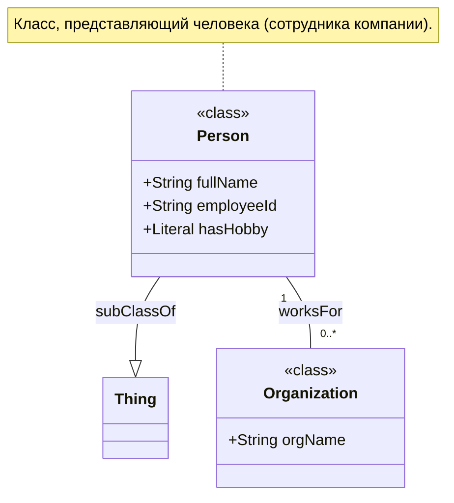

## 1 
Подробно разбери в двух вариантах:  
Первый для знающих RDF  
Второй для не знающих RDF  
```turtle
@prefix schema: <http://schema.org/>.
@prefix rdfs: <http://www.w3.org/2000/01/rdf-schema#>.
@prefix rdf: <http://www.w3.org/1999/02/22-rdf-syntax-ns#>.
@prefix xsd: <http://www.w3.org/2001/XMLSchema#>.

<tag:example.org,2026:alice> a schema:Person;
    schema:name "Алиса".
<tag:example.org,2026:alice-addr> a schema:PostalAddress.
<tag:example.org,2026:alice> schema:address <tag:example.org,2026:alice-addr>.
<tag:example.org,2026:alice-addr> schema:name "Адрес Алисы".
<tag:example.org,2026:alice> schema:streetAddress "[ул. Ленина, д. 10]";
    schema:addressLocality "[Москва]";
    schema:postalCode "[101000]";
    schema:addressCountry "[Россия]".
<tag:example.org,2026:alice-hobby-photo> a schema:Thing.
<tag:example.org,2026:alice> schema:knowsAbout <tag:example.org,2026:alice-hobby-photo>.
<tag:example.org,2026:alice-hobby-photo> schema:name "фотографией".
<tag:example.org,2026:alice-hobby-chess> a schema:Thing.
<tag:example.org,2026:alice> schema:knowsAbout <tag:example.org,2026:alice-hobby-chess>.
<tag:example.org,2026:alice-hobby-chess> schema:name "шахматами".
```

Разберём этот Turtle-документ в двух вариантах: сначала для тех, кто уже знаком с RDF, затем — в максимально простой форме.

---

# Вариант 1. Для знающих RDF

## Общая структура

Документ описывает одного человека (`alice`), её адрес (`alice-addr`) и два увлечения (`alice-hobby-photo`, `alice-hobby-chess`). Используется словарь Schema.org и пространство имён `tag:example.org,2026:` (RFC 4151, самоопределяемый URI).

## Разбор по блокам

### 1. Префиксы

```turtle
@prefix schema: <http://schema.org/>.
@prefix rdfs: <http://www.w3.org/2000/01/rdf-schema#>.
@prefix rdf: <http://www.w3.org/1999/02/22-rdf-syntax-ns#>.
@prefix xsd: <http://www.w3.org/2001/XMLSchema#>.
```

Четыре стандартных префикса. `rdfs`, `rdf`, `xsd` объявлены, но в документе не используются — это «наследие» генератора, который всегда пишет их в шапку.

### 2. Алиса — персона

```turtle
<tag:example.org,2026:alice> a schema:Person;
    schema:name "Алиса".
```

- `a` — сокращение для `rdf:type`. Триплет: `alice rdf:type schema:Person`.
- `schema:name "Алиса"` — литерал без языка и типа, по умолчанию `xsd:string`.
- `;` — группировка предикатов для одного субъекта.

### 3. Адрес — отдельная сущность

```turtle
<tag:example.org,2026:alice-addr> a schema:PostalAddress.
<tag:example.org,2026:alice> schema:address <tag:example.org,2026:alice-addr>.
<tag:example.org,2026:alice-addr> schema:name "Адрес Алисы".
```

- `alice-addr` — это **отдельный узел** (не литерал), типизированный как `schema:PostalAddress`.
- `alice schema:address alice-addr` — связь между персоной и её адресом.
- `alice-addr schema:name "Адрес Алисы"` — метка адреса.

### 4. ⚠️ Поля адреса — семантическая ошибка

```turtle
<tag:example.org,2026:alice> schema:streetAddress "[ул. Ленина, д. 10]";
    schema:addressLocality "[Москва]";
    schema:postalCode "[101000]";
    schema:addressCountry "[Россия]".
```

**Проблема:** эти свойства привязаны к `alice`, а не к `alice-addr`. В Schema.org `streetAddress`, `addressLocality`, `postalCode`, `addressCountry` — свойства класса `PostalAddress`, а не `Person`. Правильно было бы:

```turtle
<tag:example.org,2026:alice-addr> schema:streetAddress "ул. Ленина, д. 10";
    schema:addressLocality "Москва";
    schema:postalCode "101000";
    schema:addressCountry "Россия".
```

Причина ошибки — в исходном MD-LD: аннотация `{+ex:alice-addr ...}` создаёт **временный объект**, но не переключает текущий субъект. Последующие строки `[ул. Ленина, д. 10] {schema:streetAddress}` по-прежнему относятся к `alice`.

**Вторая проблема:** квадратные скобки `[ул. Ленина, д. 10]` попали в литерал. В MD-LD `[...]` — это носитель значения, скобки не должны сохраняться. Правильно: `"ул. Ленина, д. 10"`.

### 5. Увлечения

```turtle
<tag:example.org,2026:alice-hobby-photo> a schema:Thing.
<tag:example.org,2026:alice> schema:knowsAbout <tag:example.org,2026:alice-hobby-photo>.
<tag:example.org,2026:alice-hobby-photo> schema:name "фотографией".
```

- `alice-hobby-photo` — отдельный узел типа `schema:Thing`.
- `alice schema:knowsAbout alice-hobby-photo` — связь «Алиса разбирается в фотографии».
- `schema:name "фотографией"` — творительный падеж («увлекается фотографией») сохранён как метка. Семантически корректнее было бы `"фотография"`.

То же для `alice-hobby-chess` → `"шахматами"`.

## Итог для RDF-специалиста

| Аспект | Оценка |
|---|---|
| Синтаксис Turtle | Валиден, но `rdfs`, `rdf`, `xsd` не используются |
| Онтология | Schema.org применён корректно, кроме полей адреса |
| Семантика адреса | ❌ Ошибка: поля адреса на `alice`, а не на `alice-addr` |
| Литералы | ❌ Квадратные скобки внутри строк — артефакт MD-LD |
| Падежи | ⚠️ Метки в творительном падеже («фотографией») — не идеально |
| Named graphs | Отсутствуют: всё в default graph |

---

# Вариант 2. Для не знающих RDF

## Аналогия: карточки в картотеке

Представьте, что у вас есть **картотека**. Каждая карточка — это отдельная сущность. На карточке написано её имя и набор фактов о ней.

Turtle — это способ **записать карточки текстом**. Каждая строка — один факт. Факт состоит из трёх частей:

```
КТО → ЧТО ДЕЛАЕТ / ЧЕМ ЯВЛЯЕТСЯ → ЗНАЧЕНИЕ
```

Это называется **триплет** (тройка).

## Что написано в вашем документе

### 1. Сокращения в начале

```turtle
@prefix schema: <http://schema.org/>.
```

Это как **сокращения в словаре**. Вместо того чтобы каждый раз писать `http://schema.org/name`, можно писать `schema:name`. Договорились, что `schema` = `http://schema.org/`.

Аналогия: вместо «Московская область, город Москва, улица Ленина» вы пишете «Москва, ул. Ленина».

### 2. Карточка Алисы

```turtle
<tag:example.org,2026:alice> a schema:Person;
    schema:name "Алиса".
```

Перевод на русский:

- **Карточка Алисы** — это **Человек**.
- **Имя карточки Алисы** — «Алиса».

`a` — это сокращение для «является». `<tag:...alice>` — уникальный номер карточки (как штрих-код).

### 3. Карточка адреса

```turtle
<tag:example.org,2026:alice-addr> a schema:PostalAddress.
```

Отдельная карточка с номером `alice-addr`. Она — **Почтовый адрес**.

```turtle
<tag:example.org,2026:alice> schema:address <tag:example.org,2026:alice-addr>.
```

**У карточки Алисы** есть **адрес**, и этот адрес — **карточка alice-addr**.

То есть: «Алиса → её адрес → карточка alice-addr». Это ссылка с одной карточки на другую.

### 4. ⚠️ Здесь ошибка

```turtle
<tag:example.org,2026:alice> schema:streetAddress "[ул. Ленина, д. 10]";
    schema:addressLocality "[Москва]";
    ...
```

Перевод:

- **У карточки Алисы** → **улица** → «[ул. Ленина, д. 10]».
- **У карточки Алисы** → **город** → «[Москва]».

Но по логике это должно быть **у карточки адреса**, а не у Алисы! Улица, город, индекс — это свойства **адреса**, а не человека. Правильно было бы:

```turtle
<tag:example.org,2026:alice-addr> schema:streetAddress "ул. Ленина, д. 10";
    schema:addressLocality "Москва";
    ...
```

**Аналогия ошибки:** вы записали «У Алисы — улица Ленина». Но правильнее: «У адреса Алисы — улица Ленина». Алиса сама по себе не имеет улицы — её имеет её адрес.

**Вторая ошибка:** квадратные скобки `[ул. Ленина, д. 10]` остались внутри значения. В итоге в карточке написано буквально «[ул. Ленина, д. 10]» вместе со скобками. Это как если бы вы в анкете написали «[Иванов]» вместо «Иванов».

### 5. Увлечения

```turtle
<tag:example.org,2026:alice-hobby-photo> a schema:Thing.
<tag:example.org,2026:alice> schema:knowsAbout <tag:example.org,2026:alice-hobby-photo>.
<tag:example.org,2026:alice-hobby-photo> schema:name "фотографией".
```

Перевод:

- Есть карточка `alice-hobby-photo`, она — **Вещь**.
- **У Алисы** → **разбирается в** → **карточка alice-hobby-photo**.
- **У карточки alice-hobby-photo** → **название** → «фотографией».

Смысл: «Алиса разбирается в фотографии».

Слово «фотографией» стоит в творительном падеже, потому что в исходном тексте было «увлекается **фотографией**». Для машины это просто строка, но если вы хотите делать запросы, лучше писать «фотография» — иначе придётся искать и «фотография», и «фотографией», и «фотографию».

То же для шахмат.

## Как это выглядит в виде таблицы

| Кто | Что | Значение |
|---|---|---|
| Карточка Алисы | является | Человек |
| Карточка Алисы | имя | «Алиса» |
| Карточка адреса | является | Почтовый адрес |
| Карточка Алисы | адрес | карточка адреса |
| Карточка адреса | название | «Адрес Алисы» |
| Карточка Алисы | улица | «[ул. Ленина, д. 10]» ❌ |
| Карточка Алисы | город | «[Москва]» ❌ |
| Карточка Алисы | индекс | «[101000]» ❌ |
| Карточка Алисы | страна | «[Россия]» ❌ |
| Карточка фото | является | Вещь |
| Карточка Алисы | разбирается в | карточка фото |
| Карточка фото | название | «фотографией» ⚠️ |
| Карточка шахмат | является | Вещь |
| Карточка Алисы | разбирается в | карточка шахмат |
| Карточка шахмат | название | «шахматами» ⚠️ |

## Что нужно исправить

```turtle
<tag:example.org,2026:alice> schema:streetAddress "ул. Ленина, д. 10";
    schema:addressLocality "Москва";
    schema:postalCode "101000";
    schema:addressCountry "Россия".
```

Две правки:
1. Заменить субъект с `alice` на `alice-addr`.
2. Убрать квадратные скобки из значений.

## Что такое RDF одним предложением

RDF — это способ описать мир в виде **троек** «кто → что → значение», где каждая сущность имеет уникальный номер (IRI), а значения могут быть либо строками, либо ссылками на другие сущности.

## Что такое Turtle

Turtle — это **текстовая запись** RDF. Она сокращает длинные номера через префиксы (`schema:` вместо `http://schema.org/`), группирует факты об одном субъекте через `;` и использует `a` вместо `rdf:type`.

---

## 💎 Резюме для обоих вариантов

| Проблема | Для RDF-специалиста | Для новичка |
|---|---|---|
| Поля адреса на `alice` | Нарушение domain/range Schema.org | Улица записана у человека, а не у адреса |
| Скобки в литералах | Артефакт MD-LD, не очищенный парсером | В анкете написано «[Иванов]» вместо «Иванов» |
| Падежи | Не мешает SPARQL, но снижает качество данных | «фотографией» вместо «фотография» |
| Неиспользуемые префиксы | Избыточность, генерируемая шаблоном | Лишние сокращения в словаре |

**Ссылки:**
- Schema.org Person — https://schema.org/Person
- Schema.org PostalAddress — https://schema.org/PostalAddress
- Turtle (W3C) — https://www.w3.org/TR/turtle/
- RFC 4151 (tag URI) — https://www.rfc-editor.org/rfc/rfc4151
- RDF 1.1 Primer (W3C) — https://www.w3.org/TR/rdf11-primer/

## 1.1

http://schema.org/ Person;

`http://schema.org/Person` — это описание типа **Person** в словаре Schema.org. Его используют, чтобы структурировать данные о человеке и помочь поисковикам (Яндекс, Google и др.) лучше понимать контент — в итоге страница может получить расширенные сниппеты в выдаче.

## Как это выглядит в коде

Чаще всего разметку делают в формате JSON‑LD — он самый удобный и рекомендованный. Пример:

```json
{
  "@context": "https://schema.org",
  "@type": "Person",
  "name": "Иван Иванов",
  "image": "https://example.com/image.jpg",
  "jobTitle": "Программист",
  "url": "https://example.com/profile/ivan-ivanov",
  "worksFor": "ООО \"Ромашка\"",
  "description": "Специалист по разработке корпоративных приложений",
  "birthDate": "1990-05-15",
  "nationality": "Россия",
  "sameAs": ["https://vk.com/ivanov", "https://linkedin.com/in/ivan"]
}
```

---

## Ключевые свойства

**Обязательные:**
- `name` — полное имя человека.
- `@type` — должно быть `Person`.
- `@context` — обычно `https://schema.org`.

**Полезные (не обязательные, но сильно улучшают разметку):**
- `image` — ссылка на фото или объект `ImageObject`.
- `description` — краткое описание (биография, навыки).
- `url` — ссылка на профиль или персональную страницу.
- `sameAs` — массив ссылок на авторитетные профили (соцсети, Википедия и т. п.).
- `jobTitle` — должность.
- `birthDate` — дата рождения в формате ISO 8601 (например, `1990-05-15`).
- `worksFor` / `affiliation` — организация, с которой человек связан.

---

## Где это уместно применять

Разметку `Person` ставят там, где речь идёт о конкретных людях:
- страницы авторов в блогах (часто как `author` внутри разметки `Article`);
- раздел «О нас» с командой;
- профили экспертов, специалистов, сотрудников;
- новости и статьи, где важно указать автора.

Пример связки: в разметке статьи (`Article`) свойство `author` может ссылаться на объект `Person` — так поисковик поймёт, кто написал материал.

---

## 2 ontology

Это очень важный вопрос, касающийся основ RDF и работы с онтологиями. Разница между `http://schema.org/Person` и `http://schema.org#Person` — это фундаментальное различие в том, как устроены пространства имён в интернете.

### 🧐 В чём разница: `/` vs `#`

Вы правы, оба варианта технически допустимы, но они ведут себя по-разному.

*   **`http://schema.org/Person` (слэш `/`)**: Это URI, который указывает на отдельный **документ** в интернете. Если вы откроете его в браузере, сервер Schema.org, скорее всего, вернёт вам HTML-страницу с описанием класса `Person`. Это называется **«slash namespace»** (пространство имён со слэшем). Основное преимущество в том, что каждый термин (класс или свойство) может иметь свою собственную страницу и управляться независимо.

*   **`http://schema.org#Person` (решётка `#`)**: Это URI, который указывает на **фрагмент** внутри одного большого документа. Часть до решётки (`http://schema.org`) — это адрес документа, а часть после решётки (`Person`) — это идентификатор внутри этого документа. Браузер **никогда не отправляет часть после `#` на сервер**; он ищет этот фрагмент уже внутри загруженного документа. Это называется **«hash namespace»** (пространство имён с решёткой).

### ⚖️ Сравнение подходов

Согласно рекомендациям W3C, оба подхода допустимы, но у каждого есть свои сильные и слабые стороны.

| Характеристика | `/` (Слэш, как у Schema.org) | `#` (Решётка, как у RDF, FOAF) |
| :--- | :--- | :--- |
| **Что это** | Отдельный документ для каждого термина | Один документ для всего словаря |
| **Гибкость** | **Высокая**. Можно разбить словарь на модули и публиковать их отдельно. | **Низкая**. Все термины должны быть в одном файле, что может быть проблематично для больших словарей. |
| **Скорость** | Требует отдельного HTTP-запроса для каждого термина. | **Быстрее**, так как вся информация о словаре уже загружена с одним документом. |
| **Простота публикации** | Требует настройки сервера (например, перенаправлений 303), что не всегда возможно. | **Проще**. Достаточно одного файла, который можно редактировать вручную. |
| **Примеры** | Schema.org, Dublin Core | RDF, RDFS, FOAF, SKOS |

**Вывод**: Schema.org использует слэш, потому что это огромный, развивающийся словарь с более чем 2500 терминами, который нуждается в модульности. В то же время, RDF и FOAF используют решётку, так как их словари компактны и удобны для публикации в виде одного файла.

### 📝 Все возможные разделители в префиксах

В объявлении `@prefix` вы можете использовать любой из этих вариантов, и он будет работать:

1.  **Слэш (`/`)**: `@prefix schema: <http://schema.org/> .` — **Рекомендуемый и наиболее гибкий вариант.**
2.  **Решётка (`#`)**: `@prefix rdf: <http://www.w3.org/1999/02/22-rdf-syntax-ns#> .` — **Классический вариант для словарей, публикуемых одним файлом.**
3.  **Без разделителя**: `@prefix ex: <http://example.org/vocab> .` — **Технически возможно, но не рекомендуется.** Это может привести к путанице при объединении с другими словарями, так как невозможно будет однозначно отделить пространство имён от локального имени.

### 🆚 Отличие в использовании в Foam

Foam — это инструмент для создания персональных баз знаний, который работает с Markdown-файлами. Он не является RDF-редактором, но поддерживает семантические связи.

*   **В Foam** для создания связей используется синтаксис **`[[wikilink]]`**. Например, `[[Person]]` создаст ссылку на заметку с именем "Person". Foam не использует RDF-префиксы, такие как `schema:Person`. Семантика в Foam строится на основе **ссылок между заметками**, а не на формальных онтологиях.
*   **В RDF (например, в Turtle)** для этого используется **`<IRI>`** или **`prefixed:Name`**. Например, `<http://schema.org/Person>` или `schema:Person`. Это формальное, машиночитаемое описание связи с конкретным классом из определённой онтологии.

### 📚 Другие онтологии для описания персон

Schema.org — не единственный словарь для описания людей. Выбор онтологии зависит от вашей задачи.

1.  **FOAF (Friend of a Friend)**
    *   **URI**: `http://xmlns.com/foaf/0.1/Person` (слэш-неймспейс).
    *   **Фокус**: Описание людей и **социальных связей** между ними (`foaf:knows`).
    *   **Применение**: Идеально подходит для социальных графов, сетей контактов.

2.  **vCard Ontology**
    *   **URI**: `http://www.w3.org/2006/vcard/ns#Individual` (хэш-неймспейс).
    *   **Фокус**: Описание **контактной информации**: адреса, телефоны, email, имена (соответствует формату vCard).
    *   **Применение**: Лучший выбор для адресных книг, систем управления контактами.

3.  **ISA Core Person Vocabulary**
    *   **URI**: Определяется в пространстве имён Европейской комиссии.
    *   **Фокус**: Описание **фундаментальных характеристик** человека (имя, пол, дата рождения) для государственного сектора.
    *   **Применение**: Интеграция данных в государственных информационных системах.

**Чем определяется выбор?** Он зависит от **цели**:
*   Нужны социальные связи — выбирайте **FOAF**.
*   Нужны контакты — **vCard**.
*   Нужно описать человека в контексте бизнеса или событий (автор, сотрудник) — **Schema.org**.
*   Нужна максимальная совместимость с поисковыми системами — **Schema.org**.

Если у вас есть конкретная задача, я могу помочь подобрать наиболее подходящую онтологию.

## 2.1 
Я подготовил для вас обзор онтологий с классом `Person` и подробную инструкцию по созданию собственной онтологии.

### 📚 Сравнительная таблица онтологий с классом `Person`

| Онтология | Прямая ссылка на класс `Person` | Рабочая ссылка для просмотра | Фокус / Основное назначение | Префикс |
| :--- | :--- | :--- | :--- | :--- |
| **Schema.org** | `https://schema.org/Person` | Работает напрямую | Универсальный словарь для веб-разметки, SEO, структурированных данных | `schema:` |
| **FOAF** | `http://xmlns.com/foaf/0.1/Person` | `https://xmlns.com/foaf/spec/` | Описание людей и **социальных связей** между ними (`foaf:knows`) | `foaf:` |
| **vCard** | `http://www.w3.org/2006/vcard/ns#Individual` | `https://www.w3.org/TR/vcard-rdf/` | Описание **контактной информации**: адреса, телефоны, email | `vcard:` |
| **DBpedia** | `http://dbpedia.org/ontology/Person` | `https://dbpedia.org/ontology/Person` | Извлечение структурированных данных из Википедии | `dbo:` |
| **Wikidata** | `https://www.wikidata.org/wiki/Q5` | Работает напрямую | Глобальная база знаний, где каждый человек — это сущность `Q5` | `wd:` |
| **ISA Core** | `http://data.europa.eu/isa/1/core/Person` | `https://joinup.ec.europa.eu/collection/isa-action-1-2/document/isa-core-person-vocabulary` | Фундаментальные характеристики человека для госсектора ЕС | `isa:` |
| **PROV-O** | `http://www.w3.org/ns/prov#Person` | `https://www.w3.org/TR/prov-o/#Person` | Описание **происхождения** данных (кто, что и когда создал) | `prov:` |

> **Примечание:** Ссылки на FOAF и vCard в пространствах имён (`http://...`) не открываются в браузере напрямую, так как они предназначены для машинной обработки. Для человека предназначены их HTML-версии, указанные в столбце «Рабочая ссылка».

---

### 🛠️ Как создать свою онтологию с классом `Person`: пошаговая инструкция

В качестве примера создадим простую онтологию для описания сотрудников компании.

#### **Шаг 1. Создайте файл онтологии**
Создайте файл `ontology/example.md` по адресу: `https://github.com/bpmbpm/mdld-test/blob/main/ver2/ontology/example.md`.

#### **Шаг 2. Определите пространство имён и префиксы**
Внутри файла определите уникальное пространство имён для вашей онтологии и подключите необходимые стандартные словари.

```turtle
@prefix ex: <http://example.org/company/> .
@prefix rdfs: <http://www.w3.org/2000/01/rdf-schema#> .
@prefix rdf: <http://www.w3.org/1999/02/22-rdf-syntax-ns#> .
@prefix owl: <http://www.w3.org/2002/07/owl#> .
@prefix xsd: <http://www.w3.org/2001/XMLSchema#> .
```

#### **Шаг 3. Объявите класс `Person`**
Определите класс `Person` и укажите, что он является подклассом `owl:Thing` (базовый класс для всего).

```turtle
ex:Person a rdfs:Class ;
    rdfs:label "Person"@en , "Человек"@ru ;
    rdfs:comment "Класс, представляющий человека (сотрудника компании)."@ru ;
    rdfs:subClassOf owl:Thing .
```

#### **Шаг 4. Определите свойства (Properties) для класса `Person`**
Создайте свойства, которые будут описывать человека: `fullName`, `employeeId`, `hasHobby`.

```turtle
# Свойство для полного имени
ex:fullName a rdf:Property ;
    rdfs:label "Full Name"@en , "Полное имя"@ru ;
    rdfs:comment "Полное имя человека."@ru ;
    rdfs:domain ex:Person ;
    rdfs:range xsd:string .

# Свойство для идентификатора сотрудника
ex:employeeId a rdf:Property ;
    rdfs:label "Employee ID"@en , "Табельный номер"@ru ;
    rdfs:comment "Уникальный идентификатор сотрудника."@ru ;
    rdfs:domain ex:Person ;
    rdfs:range xsd:string .

# Свойство для увлечений
ex:hasHobby a rdf:Property ;
    rdfs:label "Has Hobby"@en , "Увлечение"@ru ;
    rdfs:comment "Хобби или увлечение человека."@ru ;
    rdfs:domain ex:Person ;
    rdfs:range rdfs:Literal .
```

#### **Шаг 5. Приведите пример использования (создайте индивида)**
Покажите, как ваша онтология работает на практике.

```turtle
# Пример: описание сотрудника Алисы
ex:Alice a ex:Person ;
    ex:fullName "Алиса Смирнова" ;
    ex:employeeId "A-001" ;
    ex:hasHobby "Фотография" , "Шахматы" .
```

#### **Шаг 6. Визуализация онтологии с помощью Mermaid**
Добавьте в ваш Markdown-файл следующую Mermaid-диаграмму, чтобы наглядно показать структуру классов и свойств.



**Пояснение к диаграмме:**
*   `Person` — это ваш основной класс.
*   `--|>` обозначает отношение `rdfs:subClassOf` (класс `Person` является подклассом `Thing`).
*   `"1" -- "0..*"` описывает связь «один ко многим» (один человек может работать в нескольких организациях или наоборот — в зависимости от определения).
*   Секция `note for` добавляет комментарий к классу.

---

### 💡 Заключение

Выбор онтологии зависит от вашей **конкретной задачи**: для социальных связей — FOAF, для контактов — vCard, для универсального описания в вебе — Schema.org. Создание собственной онтологии позволяет формализовать знания в узкой предметной области (например, для нужд конкретной компании).

## 3

Отличные вопросы. Разберём каждый по отдельности — здесь смешаны три разные проблемы: **семантическое моделирование**, **артефакт MD-LD** и **ошибка парсинга**.

## 1. Зачем отдельный узел для адреса

Короткий ответ: **не всегда нужен**. Есть два подхода, и оба легитимны.

### Подход A. Плоская модель (всё на Алисе)

```turtle
<tag:example.org,2026:alice> a schema:Person ;
    schema:name "Алиса" ;
    schema:streetAddress "ул. Ленина, д. 10" ;
    schema:addressLocality "Москва" ;
    schema:postalCode "101000" ;
    schema:addressCountry "Россия" .
```

**Плюсы:** проще, меньше триплетов, легко читается.
**Минусы:** если у Алисы **два адреса** (домашний и рабочий), вы не сможете их различить — обе улицы «склеятся» в один список.

### Подход B. Отдельный узел (как в вашем примере)

```turtle
<tag:example.org,2026:alice> a schema:Person ;
    schema:address <tag:example.org,2026:alice-addr> .

<tag:example.org,2026:alice-addr> a schema:PostalAddress ;
    schema:streetAddress "ул. Ленина, д. 10" ;
    schema:addressLocality "Москва" ;
    schema:postalCode "101000" ;
    schema:addressCountry "Россия" .
```

**Плюсы:** можно добавить второй адрес (`alice-addr-work`), третий и т.д. Каждый адрес — самостоятельная сущность со своим набором свойств.

**Минусы:** больше триплетов.

### Когда что использовать

| Ситуация | Подход |
|---|---|
| Один адрес, который никогда не изменится | Плоский (A) |
| Может быть несколько адресов | Отдельный узел (B) |
| Адрес нужно переиспользовать (например, у нескольких людей один офис) | Отдельный узел (B) |
| Адрес нужно версионировать (был один, стал другой) | Отдельный узел (B) |

**Важно:** Schema.org **разрешает оба подхода**. `schema:address` может указывать и на `PostalAddress` (узел), и на текстовый литерал.

## 2. Зачем `schema:name "Адрес Алисы"`

Это **не обязательный** триплет. Он появился в вашем примере **случайно** — из-за того, как MD-LD обрабатывает заголовки.

В исходном MD-LD было:

```markdown
## Адрес Алисы {+ex:alice-addr ?schema:address .schema:PostalAddress schema:name}
```

Аннотация `{+ex:alice-addr ... schema:name}` создаёт узел `ex:alice-addr` и **автоматически** присваивает ему метку из текста заголовка — то есть «Адрес Алисы». Это не семантическая необходимость, а **побочный эффект** токена `schema:name` в аннотации.

**Можно ли без него?** Да, легко. Уберите `schema:name` из аннотации:

```markdown
## Адрес Алисы {+ex:alice-addr ?schema:address .schema:PostalAddress}
```

Тогда триплет `alice-addr schema:name "Адрес Алисы"` не будет создан. Но тогда у узла адреса не будет человекочитаемого имени — в графе он останется «безымянным» узлом с типом `PostalAddress` и полями улицы/города. Для машины это нормально, для отладки — неудобно.

**Итог:** `schema:name "Адрес Алисы"` — это **опциональная метка для отладки**, а не обязательная часть семантики.

## 3. Откуда взялись квадратные скобки в литералах

Это **ошибка парсинга**, а не задумка. В MD-LD квадратные скобки `[...]` — это **носитель значения** (value carrier). Парсер должен извлечь текст **внутри** скобок и использовать его как литерал, **отбросив сами скобки**.

Правильно:

```markdown
[ул. Ленина, д. 10] {schema:streetAddress}
```

→ должно дать:

```turtle
schema:streetAddress "ул. Ленина, д. 10"
```

Неправильно (то, что у вас):

```turtle
schema:streetAddress "[ул. Ленина, д. 10]"
```

Скобки остались внутри строки. Это означает, что либо парсер `mdld-parse` в вашей версии не очищает скобки, либо в исходном MD-LD была нестандартная конструкция. Проверьте версию парсера — в спецификации MD-LD явно сказано, что `[text]` служит носителем значения, а сами скобки не являются частью литерала.

**Как исправить:** либо обновить парсер, либо вручную убрать скобки в пост-обработке:

```js
for (const q of result.quads) {
  if (q.object.termType === 'Literal') {
    q.object.value = q.object.value.replace(/^\[|\]$/g, '');
  }
}
```

## 4. Как выглядел бы правильный пример

Соберём всё вместе — плоская модель без лишних узлов, без `schema:name` для адреса, без скобок:

```turtle
@prefix schema: <http://schema.org/> .
@prefix ex: <tag:example.org,2026:> .

ex:alice a schema:Person ;
    schema:name "Алиса" ;
    schema:streetAddress "ул. Ленина, д. 10" ;
    schema:addressLocality "Москва" ;
    schema:postalCode "101000" ;
    schema:addressCountry "Россия" ;
    schema:knowsAbout ex:alice-hobby-photo , ex:alice-hobby-chess .

ex:alice-hobby-photo a schema:Thing ;
    schema:name "фотография" .

ex:alice-hobby-chess a schema:Thing ;
    schema:name "шахматы" .
```

**Что изменилось:**
- Убран `alice-addr` — всё на Алисе (плоская модель).
- Убран `schema:name "Адрес Алисы"`.
- Убраны квадратные скобки из литералов.
- Падежи исправлены: «фотография», «шахматы» вместо «фотографией», «шахматами».

**Если бы адресов было два:**

```turtle
ex:alice schema:address ex:alice-addr-home , ex:alice-addr-work .

ex:alice-addr-home a schema:PostalAddress ;
    schema:streetAddress "ул. Ленина, д. 10" .

ex:alice-addr-work a schema:PostalAddress ;
    schema:streetAddress "ул. Пушкина, д. 25" .
```

Здесь отдельный узел **оправдан** — иначе невозможно отличить домашний адрес от рабочего.

## 💎 Итог

| Вопрос | Ответ |
|---|---|
| Зачем отдельный узел адреса? | Только если адресов несколько или их нужно переиспользовать. Для одного адреса — не нужен. |
| Зачем `schema:name "Адрес Алисы"`? | Это артефакт MD-LD-аннотации, не семантика. Можно убрать. |
| Зачем квадратные скобки в литералах? | Это **ошибка парсинга**. В MD-LD `[...]` — носитель значения, скобки должны отбрасываться. |
| Как правильно? | Для одного адреса — плоская модель. Для нескольких — отдельные узлы. Литералы — без скобок. |

**Ссылки:**
- Schema.org PostalAddress — https://schema.org/PostalAddress
- Schema.org address (свойство) — https://schema.org/address
- MD-LD спецификация (носители значения) — https://github.com/davay42/mdld-parse/blob/HEAD/spec/index.md
- RDF 1.1 Primer — https://www.w3.org/TR/rdf11-primer/
  

