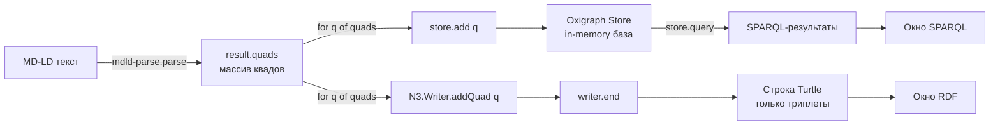

## 1
+ algorithm

Поясни, в окно RDF (Turtle) выводится ответ из какой функции? Какие настройки передачи параметров в эту функцию (полный перечень), 
например, в окно вывод полного <tag:example.org,2026:dist-alice-bob> можно ли через prefix и можно ли комбинированной записью - когда в триплете используются ; и ,

Разберём по порядку: какая функция выводит Turtle, какие у неё параметры, как добавить свой префикс для `tag:example.org,2026:` и как N3.Writer автоматически использует `;` и `,`.

## 🔍 Какая функция выводит Turtle

В окно **RDF (Turtle)** пишет результат вызов **`writer.end(callback)`** из библиотеки **N3.js**. Цепочка вызовов такая:

```js
const writer = new N3.Writer({ format: 'Turtle', prefixes: {...} });  // 1. создание
for (const q of result.quads) writer.addQuad(q);                       // 2. накопление квадов
writer.end((err, out) => { rdfEl.textContent = out; });                // 3. сериализация
```

Именно `writer.end()` возвращает готовую строку Turtle в параметр `out` callback-функции. До вызова `end()` никакой сериализации не происходит — квады просто буферизуются.

## 📋 Полный перечень параметров `new N3.Writer(options)`

N3.Writer принимает объект опций. Вот полный список:

| Параметр | Тип | Назначение | По умолчанию |
|---|---|---|---|
| `format` | string | Формат вывода: `'Turtle'`, `'TriG'`, `'N-Triples'`, `'N-Quads'`, `'N3'` | `'Turtle'` |
| `prefixes` | object | Карта префиксов: `{ ex: 'http://example.org/' }` | `{}` |
| `baseIRI` | string | Базовый IRI для относительных ссылок (`@base`) | `undefined` |
| `blankNodePrefix` | string | Префикс для blank nodes (`_:b0` → `_:myb0`) | `'b'` |
| `lists` | boolean | Использовать синтаксис списков `( ... )` для `rdf:first`/`rdf:rest` | `true` |
| `literalTypes` | boolean | Писать datatype для литералов (`"25"^^xsd:integer`) | `true` |
| `subject` | function | Кастомная сериализация субъекта | — |
| `predicate` | function | Кастомная сериализация предиката | — |
| `object` | function | Кастомная сериализация объекта | — |
| `graph` | function | Кастомная сериализация графа (для TriG/N-Quads) | — |

Методы writer'а:

| Метод | Аргументы | Что делает |
|---|---|---|
| `addQuad(quad)` | RDF/JS Quad | Добавляет готовый квад |
| `addQuad(s, p, o, g)` | 4 терма | Добавляет квад из четырёх термов |
| `addQuads(quads)` | массив Quad | Добавляет массив квадов |
| `end(callback)` | `(error, result) => {}` | Завершает и возвращает строку |
| `end()` | — | Возвращает Promise<string> (если callback не передан) |

## 🏷️ Как добавить свой префикс для `tag:example.org,2026:`

Сейчас в вашем `index.html` в `prefixes` перечислены только `schema`, `rdfs`, `rdf`, `xsd`. Поэтому IRI `tag:example.org,2026:dist-alice-bob` выводится **полностью** в угловых скобках. Чтобы он выводился как `ex:dist-alice-bob`, добавьте в `prefixes` строку:

```js
const writer = new N3.Writer({
  format: 'Turtle',
  prefixes: {
    schema: 'http://schema.org/',
    rdfs: 'http://www.w3.org/2000/01/rdf-schema#',
    rdf: 'http://www.w3.org/1999/02/22-rdf-syntax-ns#',
    xsd: 'http://www.w3.org/2001/XMLSchema#',
    ex: 'tag:example.org,2026:'        // ← добавили
  }
});
```

После этого в Turtle-выводе появится:

```turtle
@prefix ex: <tag:example.org,2026:> .
```

И все IRI с этим префиксом сократятся: `<tag:example.org,2026:dist-alice-bob>` → `ex:dist-alice-bob`.

**Важно:** префикс должен совпадать с тем, что объявлен в MD-LD через `[ex] <tag:example.org,2026:>`. Иначе N3.Writer не сможет сократить IRI, и выведет его полностью.

## ✂️ Автоматическое использование `;` и `,`

N3.Writer **автоматически группирует** триплеты:
- **Одинаковый субъект** → объединяет предикаты через `;`
- **Одинаковый субъект + предикат** → объединяет объекты через `,`
- **`rdf:type`** → заменяет на `a`

Никаких настроек для этого не нужно — это поведение по умолчанию. Пример: если у вас в графе такие триплеты:

```turtle
ex:alice a schema:Person .
ex:alice schema:name "Алиса" .
ex:alice schema:knows ex:bob .
ex:alice schema:knows ex:carol .
```

N3.Writer выведет их **сгруппированно**:

```turtle
ex:alice a schema:Person ;
    schema:name "Алиса" ;
    schema:knows ex:bob, ex:carol .
```

Это не «ручная» комбинированная запись — это результат оптимизации вывода. N3.Writer сам решает, где поставить `;` и `,`, чтобы минимизировать повторение субъекта и предиката.

## 🧪 Пример до и после добавления префикса

**До (текущий код, без `ex`):**

```turtle
<tag:example.org,2026:alice> a <http://schema.org/Person> ;
    <http://schema.org/name> "Алиса" ;
    <http://schema.org:knows> <tag:example.org,2026:bob> .
```

**После (с добавленным `ex:` и `schema:`):**

```turtle
@prefix ex: <tag:example.org,2026:> .
@prefix schema: <http://schema.org/> .

ex:alice a schema:Person ;
    schema:name "Алиса" ;
    schema:knows ex:bob .
```

Разница огромная: 1) появился `@prefix ex:`, 2) все IRI сократились, 3) `a` вместо полного `rdf:type`, 4) автоматическая группировка через `;`.

## 💎 Итог

| Вопрос | Ответ |
|---|---|
| Какая функция выводит Turtle? | `writer.end(callback)` из N3.js |
| Полный список опций? | См. таблицу выше: `format`, `prefixes`, `baseIRI`, `blankNodePrefix`, `lists`, `literalTypes`, `subject`, `predicate`, `object`, `graph` |
| Можно ли сократить `tag:example.org,2026:`? | Да, добавив `ex: 'tag:example.org,2026:'` в `prefixes` |
| Можно ли использовать `;` и `,`? | Да, N3.Writer делает это **автоматически** — настройки не нужны |

**Ссылки:**
- N3.js (GitHub) — https://github.com/rdfjs/N3.js
- N3.Writer API (документация) — https://github.com/rdfjs/N3.js/blob/main/README.md#writing
- RDF/JS Quad specification — https://rdf.js.org/data-model-spec/
- Turtle (W3C) — https://www.w3.org/TR/turtle/

## 1.1
Давайте разберём всё по порядку: сначала детально восстановим алгоритм работы вашего приложения и все вызовы внешних функций, а затем ответим на ключевой вопрос — можно ли запретить сокращения в N3.Writer.

---

## 🧭 Алгоритм работы приложения (пошагово)

Ваш `index.html` работает по следующему сценарию:

### Этап 1. Инициализация (при загрузке страницы)

1. **Импорт библиотек через CDN** (`await import(...)`):
   - `mdld-parse` — парсер MD-LD;
   - `oxigraph/web.js` — WASM-сборка RDF-хранилища;
   - `marked` — рендеринг Markdown в HTML;
   - `n3` — сериализация RDF в Turtle.

2. **Инициализация Oxigraph WASM**: вызов `oxMod.default()` компилирует WebAssembly.

3. **Создание пустого RDF-хранилища**: `new oxigraph.Store()`.

4. **Загрузка манифестов** (`fetch`):
   - `notes/manifest.json` — список заметок;
   - `SPARQL/manifest.json` — список запросов.

5. **Заполнение выпадающих списков** (`<select>`) на основе манифестов.

6. **Загрузка всех заметок в RDF-граф** (фоновая операция):
   - для каждого `.md` файла: `fetch` → `mdldParse.parse({ text })` → `store.add(quad)` для каждого квада.

### Этап 2. Работа с заметкой (при выборе в списке)

1. `fetch('./notes/<file>')` — загрузка исходного MD-LD.
2. Отображение **raw Markdown** (как есть, с аннотациями `{...}`).
3. `mdldParse.parse({ text })` — извлечение RDF-квадов и «чистого» Markdown (`result.md`).
4. `marked.parse(cleanMd)` — рендеринг очищенного Markdown в HTML.
5. Создание `N3.Writer` с префиксами.
6. `writer.addQuad(quad)` для каждого квада.
7. `writer.end(callback)` — получение строки Turtle и вывод в панель.

### Этап 3. Работа с SPARQL (при выборе запроса)

1. `fetch('./SPARQL/<file>')` — загрузка текста запроса.
2. Отображение кода запроса.
3. По кнопке **Выполнить**: `store.query(sparql)` → итерация по `binding` → построение HTML-таблицы.

### Этап 4. Логирование

Все ключевые вызовы обёрнуты в функцию `log()` и `trace()`, которые пишут в `<div id="log">`.

---

## 📞 Детальный разбор вызовов внешних функций

| № | Библиотека | Функция / метод | Аргументы | Возвращает | Где в коде |
|---|---|---|---|---|---|
| 1 | `mdld-parse` | `parse(options)` | `{ text: string }` | `{ quads: Quad[], md: string, primary, statements, origin }` | после fetch заметки |
| 2 | `oxigraph` | `new Store()` | — | объект Store | при инициализации |
| 3 | `oxigraph` | `store.add(quad)` | `Quad` | `void` | в цикле по quads |
| 4 | `oxigraph` | `store.size` | — | `number` | для лога |
| 5 | `oxigraph` | `store.query(sparql)` | `string` | итерируемый объект `Binding[]` | при выполнении SPARQL |
| 6 | `marked` | `marked.parse(md)` | `string` | `string` (HTML) | после parse MD-LD |
| 7 | `n3` | `new N3.Writer(options)` | `{ format, prefixes }` | объект Writer | перед сериализацией |
| 8 | `n3` | `writer.addQuad(quad)` | `Quad` | `void` | в цикле по quads |
| 9 | `n3` | `writer.end(callback)` | `(err, out) => void` | через callback: `string` (Turtle) | после addQuad |
| 10 | `fetch` | `fetch(url)` | `string` (URL) | `Promise<Response>` | для манифестов, заметок, SPARQL |
| 11 | `fetch` | `response.json()` | — | `Promise<any>` | для манифестов |
| 12 | `fetch` | `response.text()` | — | `Promise<string>` | для заметок и SPARQL |

**Важно:** `writer.end()` — единственная функция, которая **возвращает** готовую строку Turtle. До её вызова сериализация не происходит, квады только буферизуются.

---

## 🚫 Можно ли запретить сокращения (`;`, `,`, `a`) в N3.Writer?

**Краткий ответ: в N3.Writer нет прямой опции для этого.** Однако есть три обходных пути.

### Путь 1. Использовать формат `N-Triples` вместо `Turtle`

N-Triples по спецификации **не поддерживает** ни префиксы, ни сокращения `;`/`,`, ни `a` вместо `rdf:type`. Каждый триплет пишется в отдельной строке полностью.

```js
const writer = new N3.Writer({ format: 'N-Triples' });
```

Пример вывода:
```
<tag:example.org,2026:alice> <http://www.w3.org/1999/02/22-rdf-syntax-ns#type> <http://schema.org/Person> .
<tag:example.org,2026:alice> <http://schema.org/name> "Алиса" .
```

**Плюсы:** гарантированно полная запись без сокращений.
**Минусы:** теряются префиксы — IRI пишутся целиком; нет группировки; формат менее читаем для человека.

### Путь 2. Использовать `rdflib.js` с флагом `'p'`

Библиотека `rdflib.js` (не путать с N3.js) предоставляет флаги сериализации. Флаг `'p'` **полностью отключает сокращение префиксов** — все термы пишутся как `<...>` IRI.

```js
import { graph, serialize, sym } from 'rdflib';
const turtle = serialize(doc, kb, doc.value, 'text/turtle', undefined, { flags: 'p' });
```

Однако `rdflib.js` не является заменой Oxigraph — это отдельная библиотека с собственным store. Интеграция потребует переписывания логики.

### Путь 3. Ручная сериализация квадов

Самый надёжный способ — писать Turtle вручную, обходя N3.Writer. Вы просто итерируетесь по `result.quads` и формируете строки:

```js
function quadsToFullTurtle(quads, prefixes = {}) {
  let out = '';
  // Префиксы (опционально)
  for (const [p, iri] of Object.entries(prefixes)) {
    out += `@prefix ${p}: <${iri}> .\n`;
  }
  out += '\n';
  // Каждый квад — отдельная строка
  for (const q of quads) {
    const s = formatTerm(q.subject);
    const p = formatTerm(q.predicate);
    const o = formatTerm(q.object);
    out += `${s} ${p} ${o} .\n`;
  }
  return out;
}

function formatTerm(term) {
  if (term.termType === 'NamedNode') return `<${term.value}>`;
  if (term.termType === 'Literal') {
    let s = `"${term.value}"`;
    if (term.language) s += `@${term.language}`;
    else if (term.datatype && term.datatype.value !== 'http://www.w3.org/2001/XMLSchema#string') {
      s += `^^<${term.datatype.value}>`;
    }
    return s;
  }
  if (term.termType === 'BlankNode') return `_:${term.value}`;
  return String(term.value);
}
```

**Плюсы:** полный контроль; никаких сокращений.
**Минусы:** нужно вручную обрабатывать все типы термов; нет автоматической группировки.

---

## 📊 Сравнение вариантов

| Вариант | Сокращения `;`/`,` | `rdf:type` → `a` | Префиксы | Сложность |
|---|---|---|---|---|
| **N3.Writer (Turtle)** | ✅ Автоматически | ✅ Автоматически | ✅ Есть | Низкая |
| **N3.Writer (N-Triples)** | ❌ Нет | ❌ Нет | ❌ Нет | Низкая |
| **rdflib.js (flags: 'p')** | Зависит от флагов | Зависит от флагов | ❌ Отключены | Средняя |
| **Ручная сериализация** | ❌ Нет | ❌ Нет | ✅ Можно | Высокая |

---

## 💎 Итог

**Для запрета сокращений в N3.Writer прямой опции нет.** Самый простой путь — переключиться на `format: 'N-Triples'`, который по определению не использует сокращений. Если нужны префиксы, но без `;`/`,`/`a` — придётся писать сериализатор вручную или использовать `rdflib.js` с флагом `'p'`.

**Ссылки:**
- N3.js (Writing) — https://github.com/rdfjs/N3.js#writing
- N-Triples (W3C) — https://www.w3.org/TR/n-triples/
- rdflib.js (serializer flags) — https://github.com/linkeddata/rdflib.js
- Turtle (W3C) — https://www.w3.org/TR/turtle/

## 1.2

Разберём всё по порядку, начиная с самых базовых понятий.

---

## 1. Что такое WebAssembly и что значит «компилирует»

### Проблема, которую решает WebAssembly

Браузер умеет выполнять только **JavaScript**. Если вы хотите запустить в браузере код, написанный на Rust, C++ или Python, у вас два пути:

1. **Переписать всё на JavaScript** — долго, теряется производительность.
2. **Скомпилировать в WebAssembly (WASM)** — бинарный формат, который браузер понимает наравне с JS.

**WebAssembly** — это низкоуровневый бинарный формат, что-то вроде «ассемблера для браузера». Он не читается человеком, но выполняется очень быстро. Oxigraph написан на Rust, и чтобы он работал в браузере, его заранее скомпилировали в `.wasm` файл.

### Что делает `oxMod.default()`

```js
const oxMod = await import('https://cdn.jsdelivr.net/npm/oxigraph@latest/web.js');
await oxMod.default();
```

`oxMod.default` — это **функция-загрузчик**, которая:

1. **Скачивает `.wasm` файл** с CDN (jsDelivr).
2. **Проверяет и компилирует** его — браузер превращает бинарный WASM в машинный код процессора (это и есть «компиляция»).
3. **Создаёт мост** между JavaScript и WASM: теперь JS-код может вызывать Rust-функции Oxigraph так, как будто это обычные JS-функции.
4. **Возвращает Promise**, который разрешается, когда всё готово.

**Аналогия:** представьте, что вы получили инструкцию на иностранном языке (WASM). `await oxMod.default()` — это переводчик, который переводит её на ваш родной язык (машинный код) и теперь вы можете ею пользоваться.

**Без `await oxMod.default()`** объект `oxigraph.Store` был бы недоступен — Rust-код ещё не загружен.

---

## 2. Триплеты vs Квады — в чём разница

Это ключевой момент для понимания вашего вопроса.

### Триплет (Triple)

**Триплет** — это утверждение из **трёх** частей:

```
Субъект → Предикат → Объект
```

Пример:
```
ex:alice  schema:knows  ex:bob
```

Это говорит: «Алиса знает Боба». Три части. Отсюда «триплет».

### Квад (Quad)

**Квад** — это тот же триплет, но с **четвёртой** частью — **именованным графом** (named graph):

```
Субъект → Предикат → Объект → Граф
```

Пример:
```
ex:alice  schema:knows  ex:bob  ex:graph1
```

Это говорит: «В графе `ex:graph1` утверждается, что Алиса знает Боба».

**Зачем нужен граф?** Чтобы группировать триплеты по источникам. Например:
- Граф `notes/alice.md` — все триплеты из заметки Алисы.
- Граф `notes/bob.md` — все триплеты из заметки Боба.

Так вы можете делать запросы «только к графу Алисы» или «ко всем графам сразу».

### Почему в окне RDF вы видите триплеты, а не квады

Turtle — это формат для **триплетов**. Он не умеет показывать именованные графы. Для квадов есть отдельный формат — **TriG** (Turtle + графы) или **N-Quads**.

Когда N3.Writer сериализует квады в Turtle, он **отбрасывает четвёртую часть** (граф) и выводит только первые три. Именно поэтому в окне RDF вы видите триплеты, хотя внутри программы хранятся квады.

**Аналогия:** у вас есть таблица с колонками «Субъект, Предикат, Объект, Граф». Вы экспортируете её в формат, который поддерживает только три колонки — четвёртая теряется.

---

## 3. Откуда берутся квады

Квады создаёт **`mdld-parse.parse()`** — парсер MD-LD. Давайте проследим цепочку.

### Шаг 1. Вы пишете MD-LD

```markdown
[ex] <tag:example.org,2026:>

# Алиса {=ex:alice .schema:Person schema:name}

[Боб] {+ex:bob ?schema:knows .schema:Person schema:name}
```

### Шаг 2. `mdld-parse.parse()` анализирует текст

Парсер идёт по тексту и находит аннотации:

- `[ex] <tag:example.org,2026:>` — объявление префикса.
- `{=ex:alice .schema:Person schema:name}` — субъект `ex:alice`, тип `schema:Person`, метка «Алиса».
- `{+ex:bob ?schema:knows .schema:Person schema:name}` — объект `ex:bob`, предикат `schema:knows`, тип `schema:Person`, метка «Боб».

### Шаг 3. Парсер генерирует квады

На основе этих аннотаций `mdld-parse` создаёт массив RDF/JS-квадов. Каждый квад — это объект с четырьмя полями:

```js
{
  subject:   NamedNode('tag:example.org,2026:alice'),
  predicate: NamedNode('http://schema.org/name'),
  object:    Literal('Алиса'),
  graph:     DefaultGraph()   // ← четвёртая часть
}
```

Пример того, что вернёт `parse()` для нашего текста:

```js
result.quads = [
  { subject: ex:alice, predicate: rdf:type,      object: schema:Person, graph: default },
  { subject: ex:alice, predicate: schema:name,   object: "Алиса",        graph: default },
  { subject: ex:alice, predicate: schema:knows,  object: ex:bob,         graph: default },
  { subject: ex:bob,   predicate: rdf:type,      object: schema:Person,  graph: default },
  { subject: ex:bob,   predicate: schema:name,   object: "Боб",          graph: default },
]
```

**Именно эти квады** попадают в `store.add(quad)`.

### Шаг 4. `store.add(quad)` — добавление в хранилище

```js
for (const q of quads) store.add(q);
```

Этот цикл проходит по массиву `result.quads` и по одному добавляет каждый квад в Oxigraph Store. Store — это in-memory база данных, оптимизированная для SPARQL-запросов. После добавления всех квадов `store.size` покажет их общее количество.

---

## 4. Полный поток данных (схема)



**Ключевое:** одни и те же квады идут **в два места**:
- В `store` — для SPARQL-запросов.
- В `N3.Writer` — для отображения в Turtle.

При этом в Turtle теряется четвёртая часть (граф), потому что Turtle не поддерживает именованные графы.

---

## 5. Пошаговый алгоритм (полная версия)

### Фаза 1. Загрузка страницы

| Шаг | Что происходит | Кто выполняет |
|---|---|---|
| 1 | Браузер запрашивает `index.html` | Браузер |
| 2 | Парсит HTML, встречает `<script type="module">` | Браузер |
| 3 | Начинает выполнять JS-модуль | Браузер |
| 4 | `await import('mdld-parse')` — скачивает модуль с CDN | JS + сеть |
| 5 | `await import('oxigraph/web.js')` — скачивает JS-обёртку | JS + сеть |
| 6 | `await oxMod.default()` — скачивает `.wasm`, компилирует, инициализирует | Браузер + WASM |
| 7 | `await import('marked')`, `await import('n3')` | JS + сеть |

### Фаза 2. Создание хранилища

| Шаг | Что происходит |
|---|---|
| 8 | `new oxigraph.Store()` — создаётся пустая in-memory база RDF |
| 9 | `store.size` = 0 |

### Фаза 3. Загрузка списков

| Шаг | Что происходит |
|---|---|
| 10 | `fetch('./notes/manifest.json')` → массив имён файлов |
| 11 | `<select>` заполняется `<option>` для каждой заметки |
| 12 | `fetch('./SPARQL/manifest.json')` → массив имён запросов |
| 13 | Второй `<select>` заполняется |

### Фаза 4. Индексация всех заметок

| Шаг | Что происходит |
|---|---|
| 14 | Для каждого `.md` в манифесте: `fetch('./notes/<file>')` |
| 15 | `mdld-parse.parse({ text })` → `result.quads` (массив квадов) |
| 16 | `for (q of result.quads) store.add(q)` — по одному кваду в Store |
| 17 | `store.size` увеличивается на число квадов |
| 18 | По завершении: `store.size` = общее число квадов |

### Фаза 5. Пользователь выбирает заметку

| Шаг | Что происходит |
|---|---|
| 19 | Событие `change` на `<select>` |
| 20 | `fetch('./notes/<file>')` — загрузка исходного MD-LD |
| 21 | Показ **raw Markdown** (с аннотациями) в первой панели |
| 22 | `mdld-parse.parse({ text })` → `result.quads` + `result.md` |
| 23 | `marked.parse(result.md)` → HTML для второй панели |
| 24 | `new N3.Writer({ format: 'Turtle', prefixes })` |
| 25 | `for (q of result.quads) writer.addQuad(q)` — буферизация |
| 26 | `writer.end(callback)` → строка Turtle в третьей панели |

### Фаза 6. Пользователь выбирает SPARQL

| Шаг | Что происходит |
|---|---|
| 27 | `fetch('./SPARQL/<file>')` — загрузка текста запроса |
| 28 | Отображение кода запроса |
| 29 | Клик по **Выполнить**: `store.query(sparql)` |
| 30 | Итерация по `binding` → HTML-таблица |

---

## 6. Ответ на «непонятно: store.add(quad) для каждого квада»

**Почему по одному, а не все сразу?**

Потому что `store.add()` принимает **один** квад. Чтобы добавить массив, нужен цикл. В некоторых версиях Oxigraph есть `store.load(data, { format })`, который принимает целый файл (например, Turtle-строку) и парсит его сам — но в вашем коде используется `add()`, потому что квады уже готовы в виде объектов RDF/JS.

**Можно ли было иначе?**

Да. Если бы у вас был `.ttl` файл, вы могли бы написать:

```js
const ttl = await (await fetch('./graph.ttl')).text();
store.load(ttl, { format: 'text/turtle' });
```

Одна строка — и весь граф в Store. Но в MD-LD-подходе квады приходят из `parse()`, а не из файла, поэтому используется `add()` в цикле.

---

## 7. Ответ на «в окне RDF только триплеты»

**Потому что Turtle — формат для триплетов.**

Внутри программы:
- `result.quads` — массив **квадов** (4 части: s, p, o, g).
- `store` — хранит **квады**.
- `N3.Writer` — принимает **квады**.

Но когда Writer сериализует в Turtle, он **отбрасывает граф** (g) и пишет только s, p, o. Это ограничение формата Turtle, а не ошибка.

Если хотите увидеть графы, измените формат на TriG:

```js
const writer = new N3.Writer({ format: 'TriG', prefixes: {...} });
```

Тогда вывод будет таким:

```trig
@prefix ex: <tag:example.org,2026:> .
@prefix schema: <http://schema.org/> .

ex:notes_alice {
    ex:alice a schema:Person ;
        schema:name "Алиса" ;
        schema:knows ex:bob .
}
```

Здесь `ex:notes_alice` — это именованный граф, и видно, что триплеты сгруппированы внутри него.

---

## 💎 Итог

| Понятие | Что это |
|---|---|
| **WebAssembly** | Бинарный формат для запуска Rust/C++ в браузере |
| **`await oxMod.default()`** | Скачивает `.wasm`, компилирует в машинный код, создаёт мост JS↔WASM |
| **Триплет** | Утверждение из 3 частей: субъект, предикат, объект |
| **Квад** | Тот же триплет + 4-я часть — именованный граф |
| **Откуда квады** | Их генерирует `mdld-parse.parse()` из аннотаций `{...}` |
| **Почему в Turtle триплеты** | Формат Turtle не поддерживает графы; для квадов нужен TriG или N-Quads |
| **`store.add(quad)`** | Добавляет один квад в Oxigraph Store; цикл — потому что API принимает один квад за раз |

**Ссылки:**
- WebAssembly (MDN) — https://developer.mozilla.org/ru/docs/WebAssembly
- Oxigraph WASM — https://www.npmjs.com/package/oxigraph
- mdld-parse — https://www.npmjs.com/package/mdld-parse
- RDF/JS Quad — https://rdf.js.org/data-model-spec/
- TriG (W3C) — https://www.w3.org/TR/trig/
- N3.js Writer — https://github.com/rdfjs/N3.js#writing
