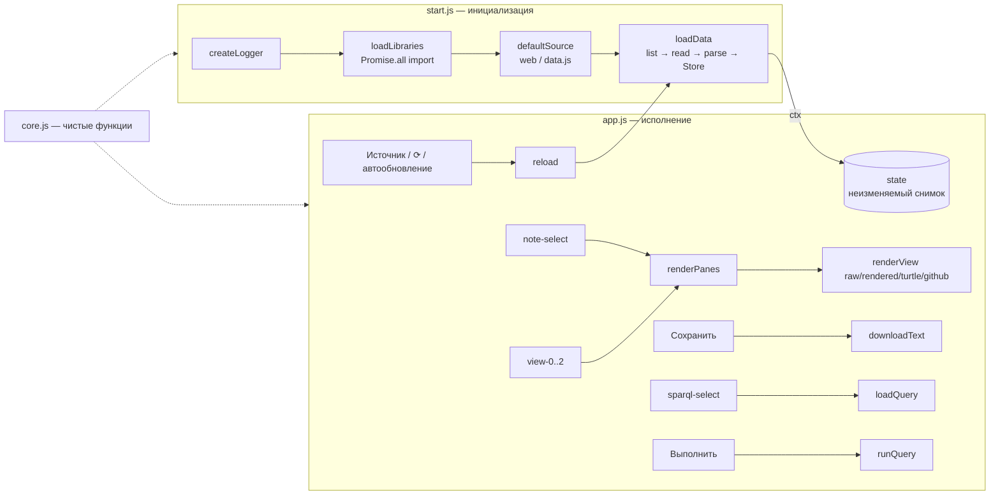
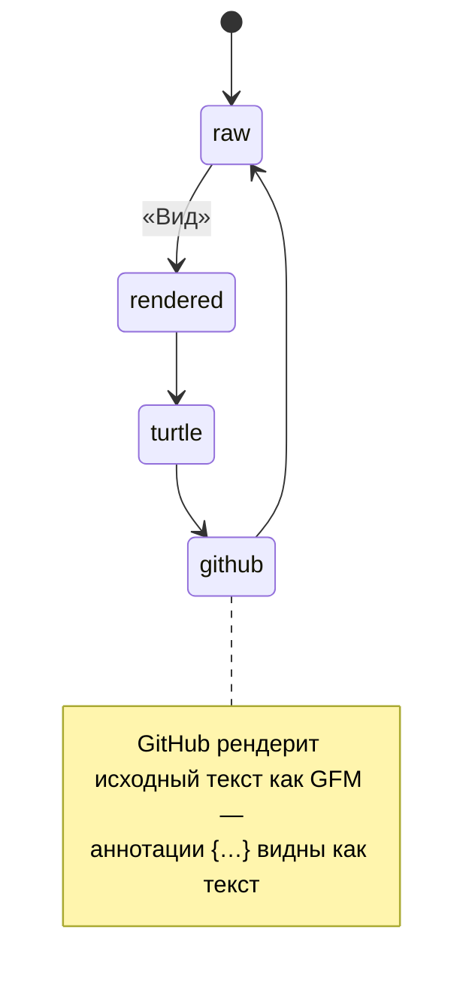

# Описание программы ver3

## Файлы

| Файл | Часть | Назначение |
|------|-------|-----------|
| `index.html` | — | разметка: источник, три окна заметки, SPARQL, лог |
| `css/style.css` | — | стили (перенесены из ver2) |
| `config.js` | настройки | `window.CONFIG`: репозиторий, версии библиотек CDN |
| `data.js` | данные | `window.MDLD_DATA`: копия `notes/` и `SPARQL/` для file:// |
| `js/core.js` | чистые функции | форматирование, таблицы SPARQL, CSV, Turtle, имена файлов |
| `js/start.js` | **1. Инициализация** | логгер, библиотеки, источники данных, разбор заметок, хранилище |
| `js/app.js` | **2. Исполнение** | обработчики событий: виды окон, сохранение, SPARQL, обновление |
| `notes/`, `SPARQL/` | данные | заметки MD-LD и запросы (+ `manifest.json`) |
| `tests/` | тесты | Node.js `node:test` + Playwright |

## Общая схема



## Последовательность запуска

```mermaid
sequenceDiagram
  participant H as index.html
  participant S as start.js
  participant CDN as jsDelivr
  participant Src as Источник
  participant O as Oxigraph
  participant A as app.js
  H->>S: MdldStart.start()
  S->>CDN: import(mdld-parse, oxigraph, marked, n3) параллельно
  S->>O: default() — init WASM
  S->>Src: list(notes,.md), list(SPARQL,.rq)
  S->>Src: read(notes, file) × N (параллельно)
  S->>S: mdld.parse → mergeQuads
  S->>O: new Store(); add(quad)
  S-->>A: ctx {libs, logger, sources, loadData, data}
  A->>A: run(ctx): обработчики событий
```

## Окно заметки: вид и сохранение



| Вид | Показ | «Сохранить» |
|-----|-------|-------------|
| Markdown (raw, с аннотациями) | исходный текст | `note1.raw.md` |
| Markdown (отрендеренный) | `marked(result.md)` — текст без аннотаций | `note1.rendered.html` |
| RDF (Turtle) | `N3.Writer(quads)` | `note1.turtle.ttl` |
| Markdown (GitHub) | `marked(исходный текст, gfm)` + `github-markdown-css` | `note1.github.html` |

SPARQL: код можно править в окне; «Сохранить» у кода → `.rq`, у результата → `<запрос>.result.csv`.

## Основные функции

| Функция | Файл | Что делает |
|---------|------|-----------|
| `createLogger(el, trace)` | start.js | логгер с цветами и трассировкой вызовов библиотек |
| `loadLibraries(logger, libs)` | start.js | параллельная загрузка 4 библиотек, init WASM |
| `webSource / githubSource / bundleSource / folderSource` | start.js | источники данных с единым интерфейсом `{list, read}` |
| `defaultSource(logger)` | start.js | выбор источника по протоколу (http / file) |
| `parseNote(libs, logger, file, text)` | start.js | MD-LD → `{quads, md}` |
| `loadData(libs, logger, source)` | start.js | загрузка всех данных и построение Store (снимок) |
| `start()` | start.js | точка входа инициализации, возвращает ctx |
| `renderView(libs, note, viewId)` | app.js | HTML и содержимое для сохранения для каждого вида |
| `run(ctx)` | app.js | привязка обработчиков, управление state |
| `renderPane(i)`, `loadQuery`, `runQuery`, `reload` | app.js | действия пользователя |
| `downloadText(name, content, mime)` | app.js | сохранение файла через Blob |
| `bindingsToTable`, `tableToHtml`, `tableToCsv` | core.js | результаты SPARQL |
| `quadsToTurtle`, `mergeQuads`, `compactIri` | core.js | RDF |
| `saveFileName`, `filesWithExt`, `buildDataJs`, `escapeHtml`, `fmt`, `traceLine` | core.js | утилиты |

См. также: [FP.md](FP.md) (функциональный стиль), [SPARQL_FIX.md](SPARQL_FIX.md), [CORS.md](CORS.md), [SYNC.md](SYNC.md).
