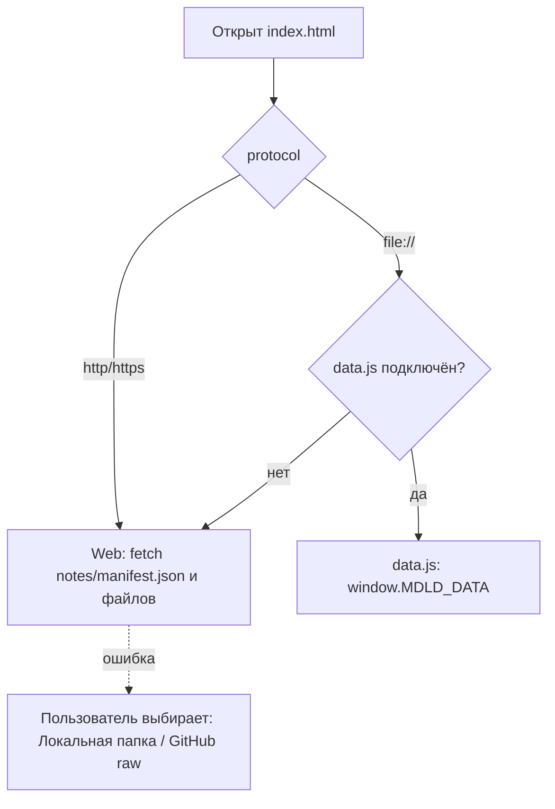

# CORS: как ver3 работает и на GitHub Pages, и локально (file://)

## Проблема
ver2 работала только через http(s): при открытии `index.html` двойным щелчком (file://) браузер блокирует
* `<script type="module">` с локального файла (origin `null`);
* `fetch('./notes/manifest.json')` и `fetch('./notes/note1.md')` — «Failed to fetch» / CORS.

## Использованные решения (только браузерный JS)

| # | Приём | Где в ver3 | Откуда взят |
|---|-------|-----------|-------------|
| 1 | Данные и настройки подключаются обычным `<script src="…js">`, задающим глобальную переменную (`window.CONFIG`, `window.MDLD_DATA`) вместо `fetch(*.json)` | `config.js`, `data.js` | [family-tree/ver7/config.js](https://github.com/bpmbpm/family-tree/blob/main/ver7/config.js), строки 1–3: «Загружается через `<script src="config.js">` в index.html, что позволяет читать настройки через file:// без ошибок CORS». Подключение — [ver7/index.html, строка 10](https://github.com/bpmbpm/family-tree/blob/main/ver7/index.html) |
| 2 | Код приложения — обычные (не `type="module"`) скрипты | `js/core.js`, `js/start.js`, `js/app.js` | там же: ver7 подключает `foto.js`, `treeview.js`, `save.js` через `<script src>` ([index.html, строки 10–14](https://github.com/bpmbpm/family-tree/blob/main/ver7/index.html)) |
| 3 | Ветвление по `window.location.protocol === 'file:'` | `defaultSource()` в `js/start.js` | [ver7/index.html, `showAlbumGallery`](https://github.com/bpmbpm/family-tree/blob/main/ver7/index.html) (строка ~494) |
| 4 | Выбор локальной папки пользователем (`<input type="file" webkitdirectory>`) и чтение файлов без fetch | источник «Локальная папка», `folderSource()` | [ver7/service_foto_desktop.html](https://github.com/bpmbpm/family-tree/blob/main/ver7/service_foto_desktop.html), строка 185: `input.webkitdirectory = true` |
| 5 | Чтение выбранного файла вместо fetch (`FileReader` / `File.text()`) | `folderSource().read` | [ver7/index.html, `loadFromFile`](https://github.com/bpmbpm/family-tree/blob/main/ver7/index.html) (строка ~2081) |
| 6 | Сохранение через `Blob` + `URL.createObjectURL` + `<a download>` | `downloadText()` в `js/app.js` | [ver7/save.js](https://github.com/bpmbpm/family-tree/blob/main/ver7/save.js) (строки 271–272) |

Библиотеки (`mdld-parse`, `oxigraph`, `marked`, `n3`) загружаются динамическим `import()` с jsDelivr.
Это работает и по file://, потому что CDN отвечает `Access-Control-Allow-Origin: *` (проверено `curl -I`).
Источник «GitHub (raw)» использует `api.github.com` и `raw.githubusercontent.com` — они тоже отдают `Access-Control-Allow-Origin: *`.

## Какой источник выбирается

Проверено автотестом `tests/e2e.test.js` в Chromium для http:// и file://.
