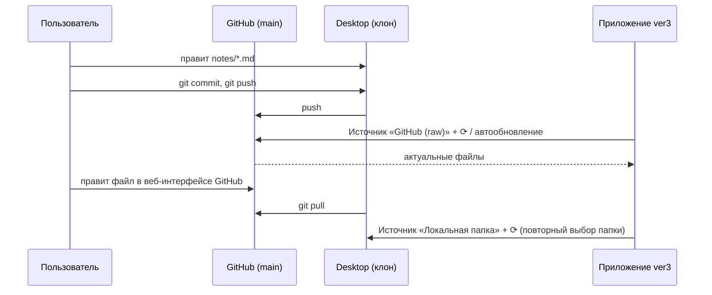

# Синхронизация ver3 (GitHub ⇄ локальная папка) через git

Исполняемые файлы (`index.html`, `config.js`, `data.js`, `js/`, `css/`) и данные (`notes/`, `SPARQL/`)
лежат в одной папке `ver3` репозитория. Синхронизация «GitHub ⇄ desktop» выполняется git,
а приложение подхватывает изменения кнопкой **⟳ Обновить** (или флажком «автообновление»).

## 1. Установка и идентификация (один раз)

```bash
# 1) Git: https://git-scm.com/downloads
git config --global user.name  "Ваше Имя"
git config --global user.email "you@example.com"      # e-mail аккаунта GitHub (или noreply)

# 2) Аутентификация — выберите ОДИН способ:
# а) GitHub CLI (проще всего): https://cli.github.com
gh auth login            # GitHub.com → HTTPS → Login with a web browser
gh auth setup-git        # git будет брать токен из gh

# б) SSH-ключ
ssh-keygen -t ed25519 -C "you@example.com"
# добавить содержимое ~/.ssh/id_ed25519.pub: GitHub → Settings → SSH and GPG keys → New SSH key
ssh -T git@github.com    # проверка

# в) Personal Access Token (HTTPS): GitHub → Settings → Developer settings → Tokens
#    (fine-grained, доступ Contents: Read and write) — вводится вместо пароля при git push;
git config --global credential.helper store   # или manager (Windows) / osxkeychain (macOS)
```

## 2. Получение проекта на desktop

```bash
git clone https://github.com/bpmbpm/mdld-test.git     # или git@github.com:bpmbpm/mdld-test.git
cd mdld-test/ver3
```
Откройте `ver3/index.html` двойным щелчком (file://) — см. doc/CORS.md.

## 3. Изменили файлы на GitHub → обновить desktop
```bash
git pull
```
Затем в приложении — **⟳ Обновить**.

## 4. Изменили файлы локально → отправить на GitHub
```bash
git status
git add notes SPARQL data.js
git commit -m "Обновил заметки"
git push
```
GitHub Pages обновится через 1–2 минуты (https://bpmbpm.github.io/mdld-test/ver3/).

## 5. Что нужно поддерживать при добавлении/удалении файлов

| Файл | Зачем | Как обновить |
|------|-------|--------------|
| `notes/manifest.json`, `SPARQL/manifest.json` | список файлов для режима Web (GitHub Pages не умеет листинг папок) | вписать имя файла |
| `data.js` | копия данных для режима file:// без сети | кнопка **Экспорт data.js** (браузер) или `node tests/build-data.js` |

Режимы «Локальная папка» и «GitHub (raw)» манифесты и data.js НЕ используют — они сами читают содержимое папок,
поэтому всегда показывают актуальное состояние диска / ветки GitHub.
Тест `tests/sparql.test.js` проверяет, что манифесты и data.js соответствуют папкам.

## 6. Режимы обновления в приложении



Примечание: браузер не даёт странице следить за файлами на диске. Для «Локальной папки» ⟳ заново
открывает диалог выбора папки (объекты `File` — снимок на момент выбора). Для Web/GitHub-источников
работает периодическое автообновление (GitHub API без токена — до 60 запросов в час, поэтому интервал ≥ 60 с).
